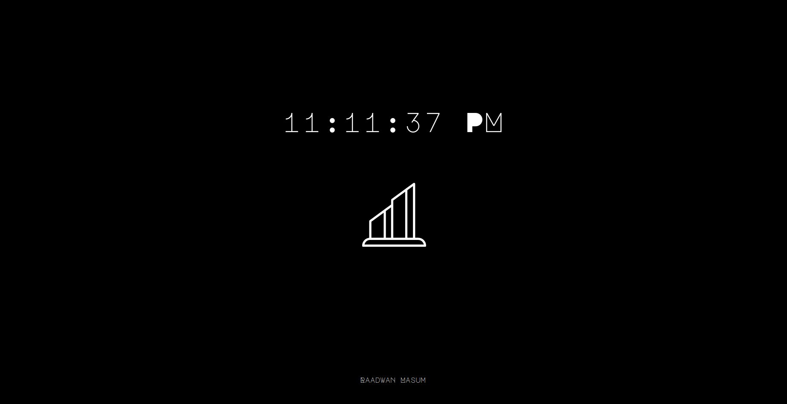
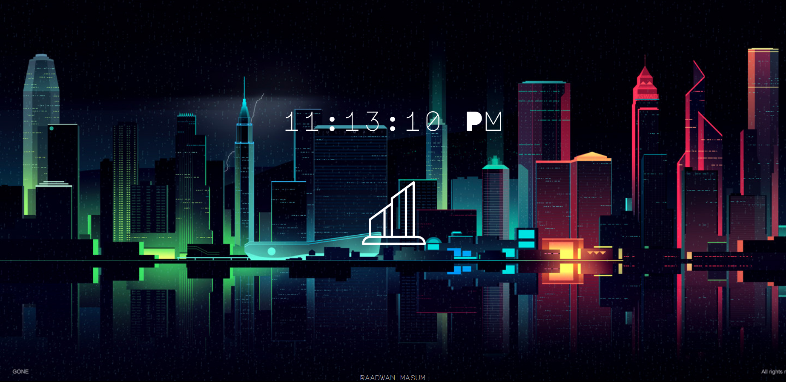

# city-tabs 
Cool city new tabs for chromium.

## Usage
[Install Chrome Extension](https://chrome.google.com/webstore/detail/custom-new-tab-url/mmjbdbjnoablegbkcklggeknkfcjkjia?hl=en) 
Set URL to `https://raadwan.com/city-tabs`

## New Tab

## 👨‍💻 Contact
Linkedin: [Raadwan Masum](https://www.linkedin.com/in/raadwan-masum-9147bb1a5)
 
Github: [raad1masum](https://github.com/raad1masum)
 
Devpost: [Raadwan masum](https://devpost.com/raad1masum)

## 🤝 Contributing

Contributions, PRs, issues and feature requests are welcome! Feel free to check out the [issues page](https://github.com/raad1masum/city-tabs/issues). 

## ❤️ Show your support

Give a ⭐️ if you liked this project!
Hope you enjoy!
